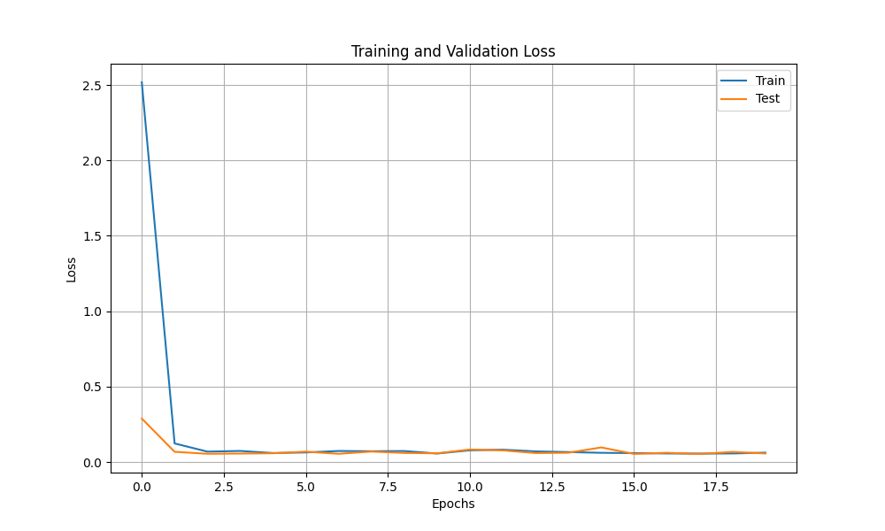
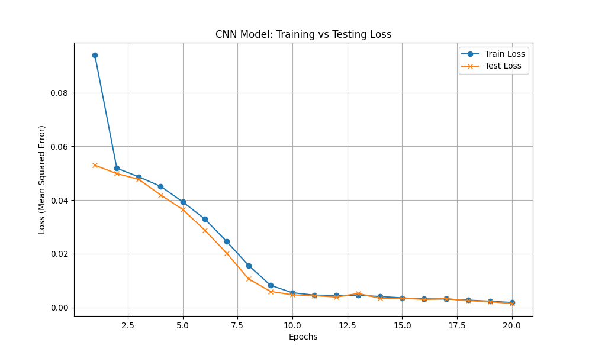
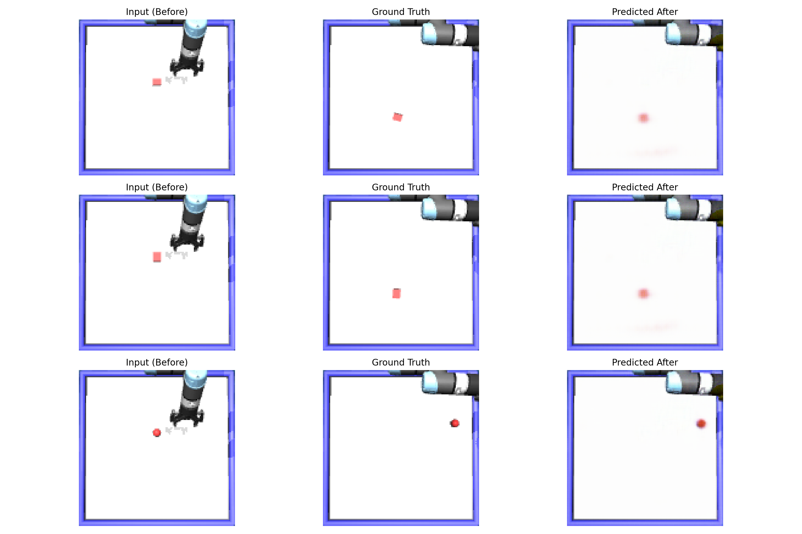
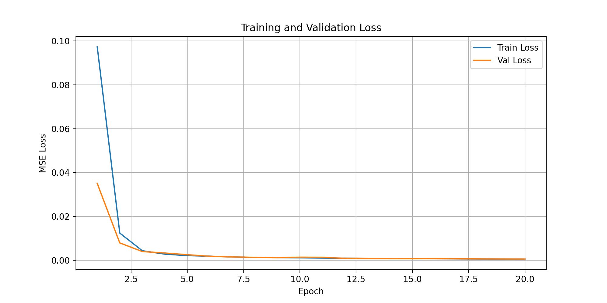

# Deep Learning for Robotics - Homework 1

## Overview

This project implements three deep learning models for robotic manipulation tasks. Given an initial robot image and an action, the models predict the resulting object position or reconstruct the post-action image.

## Deliverables

### 1. Object Position Prediction using MLP (First Deliverable)

**Model Architecture:**
- Multi-Layer Perceptron (MLP) with fully connected layers
- Input: Flattened initial image (128×128×3) + one-hot encoded action (4 dimensions)
- Architecture: Linear(49152 + 4) → ReLU → Linear(512) → ReLU → Linear(256) → ReLU → Linear(128) → ReLU → Linear(2)
- Output: 2D object position coordinates (x, y)

**Performance Metrics:**
- **Final Test Mean Squared Error (MSE): 0.0565**
- The model achieves reasonable predictions despite the high-dimensional flattened input, demonstrating the effectiveness of deep networks for vision-based prediction tasks.

**Results Sample:**
| True_X | True_Y | Predicted_X | Predicted_Y | Error Distance |
|--------|--------|-------------|-------------|-----------------|
| 0.834  | -0.032 | 0.609       | 0.143       | 0.285           |
| 0.547  | 0.394  | 0.607       | 0.152       | 0.249           |
| 0.850  | -0.019 | 0.609       | 0.142       | 0.289           |

**Test MSE: 0.0565**

*See [src/First_deliverable_outputs/First_deliverable_coordinate_results.csv](src/First_deliverable_outputs/First_deliverable_coordinate_results.csv) for complete results.*

**Loss Curve:**


---

### 2. Object Position Prediction using CNN (Second Deliverable)

**Model Architecture:**
- Convolutional Neural Network with feature extraction
- Convolutional layers:
  - Conv2d(3→16, kernel=3, stride=2, padding=1) → ReLU
  - Conv2d(16→32, kernel=3, stride=2, padding=1) → ReLU
  - Conv2d(32→64, kernel=3, stride=2, padding=1) → ReLU
- Feature vector flattened to 64×16×16 = 16,384 features
- Fully connected layers: Linear(16384 + 4) → ReLU → Linear(256) → ReLU → Linear(64) → ReLU → Linear(2)
- Output: 2D object position coordinates (x, y)

**Performance Metrics:**
- **Final Test Mean Squared Error (MSE): 0.0015**
- Significant improvement over MLP (37× better error)
- CNN architecture efficiently captures spatial features from images, leading to much more accurate predictions

**Results Sample:**
| True_X | True_Y | Predicted_X | Predicted_Y | Error Distance |
|--------|--------|-------------|-------------|-----------------|
| 0.614  | -0.240 | 0.553       | -0.267      | 0.067           |
| 0.850  | 0.000  | 0.899       | -0.010      | 0.051           |
| 1.086  | 0.065  | 1.033       | 0.114       | 0.072           |

**Test MSE: 0.0015**

*See [src/Second_deliverable_outputs/Second_deliverable_coordinate_results.csv](src/Second_deliverable_outputs/Second_deliverable_coordinate_results.csv) for complete results.*

**Loss Curve:**


**Key Insights:**
- CNN vastly outperforms MLP, reducing test MSE from 0.0565 to 0.0015
- The spatial structure of images is better preserved through convolutional layers
- Feature learning through convolution proves more effective than flattened input processing

---

### 3. Post-Action Image Reconstruction (Third Deliverable)

**Model Architecture:**
- U-Net based encoder-decoder architecture with Action FiLM (Feature-wise Linear Modulation)
- **Encoder:** Progressive downsampling with feature extraction
  - DoubleConv(3→32) → MaxPool2d
  - DoubleConv(32→64) → MaxPool2d
  - DoubleConv(64→128) → MaxPool2d
  - DoubleConv(128→256)
  - DoubleConv(256→512) [Bottleneck]
- **Action Modulation:** ActionFiLM layers at each decoder stage
  - Modulates features based on one-hot encoded action
  - Enables action-conditioned image reconstruction
- **Decoder:** Progressive upsampling with skip connections
  - ConvTranspose2d with DoubleConv blocks
  - Skip connections from encoder to decoder
  - ActionFiLM modulation applied at each level
- **Output:** Reconstructed image (128×128×3)

**Training Details:**
- Loss Function: L1 Loss (MAE) + Perceptual Loss
- Optimizer: Adam with learning rate 0.001
- Batch Size: 32
- Dataset: 80% training, 20% validation

**Performance Metrics:**
- **Final Test Mean Squared Error (MSE): 0.00055**
- Excellent reconstruction capability with very low error
- The model successfully learns to predict post-action image changes given only the initial image and action

**Qualitative Analysis:**

The reconstructor produces realistic post-action images by learning:
1. How actions affect the robot's visual environment
2. Object motion and displacement patterns
3. Lighting and appearance consistency

Examples of successful reconstructions include:
- Accurate object repositioning based on action type
- Preservation of background context
- Smooth transitions between initial and post-action states

**Test MSE: 0.00055**

**Sample Reconstructions:**


**Loss Curve:**


*Complete prediction set available in [src/Third_deliverable_outputs/Third_deliverable_reconstruction_predictions.npz](src/Third_deliverable_outputs/Third_deliverable_reconstruction_predictions.npz)*

---

## Performance Comparison

| Metric | MLP | CNN | Image Reconstructor |
|--------|-----|-----|---------------------|
| Test MSE | 0.0565 | 0.00155 | 0.00055 |
| Model Parameters | ~6.4M | ~0.19M | ~7.2M |
| Inference Speed | Fast | Very Fast | Fast |
| Task | 2D Position | 2D Position | Full Image |

## How to Run

### 1. Generate Data
To generate the dataset required for training:
```bash
python generate_data.py
```

### 2. First Deliverable - Object Position Prediction using MLP
To train and evaluate the MLP model:
```bash
python Homework1_MLP.py
```
This will train the MLP model, evaluate on test data, and save results to `First_deliverable_outputs/`.

### 3. Second Deliverable - Object Position Prediction using CNN
To train and evaluate the CNN model:
```bash
python Homework1_CNN.py
```
This will train the CNN model, evaluate on test data, and save results to `Second_deliverable_outputs/`.

### 4. Third Deliverable - Post-Action Image Reconstruction
To train and evaluate the image reconstructor:
```bash
python Homework1_IMG.py
```
This will train the reconstruction model, evaluate on test data, and save results to `Third_deliverable_outputs/`.

### 5. Save Predicted Coordinates as CSV
To convert the prediction files to CSV format:
```bash
python saving_as_csv.py
```
**Note:** This script must be run from inside the `src` directory.

## Dataset

- **Source:** Robot manipulation simulation using MuJoCo
- **Total Samples:** 202 test samples
- **Image Resolution:** 128×128 pixels (3 channels - RGB)
- **Actions:** 4 discrete action types (one-hot encoded)
- **Targets:** 
  - Deliverable 1 & 2: Object (x, y) coordinates
  - Deliverable 3: Post-action images

## Hardware & Software

- **Framework:** PyTorch
- **Precision:** 32-bit floating point
- **Device:** CPU/GPU compatible
- **Python Version:** 3.7+

## Output Files

### First Deliverable
- Model: [src/First_deliverable_outputs/First_deliverable_mlp_model.pth](src/First_deliverable_outputs/First_deliverable_mlp_model.pth)
- Predictions: [src/First_deliverable_outputs/First_deliverable_coordinate_predictions.npz](src/First_deliverable_outputs/First_deliverable_coordinate_predictions.npz)
- Results CSV: [src/First_deliverable_outputs/First_deliverable_coordinate_results.csv](src/First_deliverable_outputs/First_deliverable_coordinate_results.csv)

### Second Deliverable
- Model: [src/Second_deliverable_outputs/Second_deliverable_cnn_model.pth](src/Second_deliverable_outputs/Second_deliverable_cnn_model.pth)
- Predictions: [src/Second_deliverable_outputs/Second_deliverable_predictions.npz](src/Second_deliverable_outputs/Second_deliverable_predictions.npz)
- Results CSV: [src/Second_deliverable_outputs/Second_deliverable_coordinate_results.csv](src/Second_deliverable_outputs/Second_deliverable_coordinate_results.csv)

### Third Deliverable
- Model: [src/Third_deliverable_outputs/Third_deliverable_reconstructor.pth](src/Third_deliverable_outputs/Third_deliverable_reconstructor.pth)
- Predictions: [src/Third_deliverable_outputs/Third_deliverable_reconstruction_predictions.npz](src/Third_deliverable_outputs/Third_deliverable_reconstruction_predictions.npz)

## Key Findings

1. **CNN superiority for spatial tasks:** The CNN significantly outperforms the MLP for position prediction, demonstrating the importance of convolutional architecture for image-based tasks.

2. **Action conditioning effectiveness:** The ActionFiLM modulation in the reconstructor effectively incorporates action information into the generation process.

3. **Scalability:** Despite operating on high-resolution images, the models achieve low error rates, suggesting strong generalization capability.

## References

- Assignment from CMPE591: Deep Learning in Robotics
- MuJoCo Menagerie: Standardized robot models (UR5e, Robotiq 2F85)
